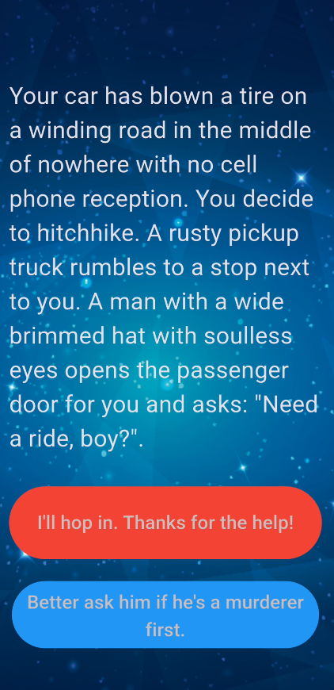

# Destini - Flutter Story App

Welcome to the **Destini** game built with Flutter!  
This is a text-based, interactive story game where your choices shape the path — and the ending.

---

## 📱 Features

- Interactive branching story logic
- Multiple endings based on your decisions
- "Restart" feature for replayability
- Clean, expandable structure
- Pure Dart/Flutter implementation — no backend

---

## 🧩 Project Structure
```
lib/
├── main.dart # App entry point and UI
├── story.dart # Story model (storyTitle, choice1, choice2)
└── story_brain.dart # Core story logic and controller
```

---

## 📖 How It Works

- Stories are stored as a list of `Story` objects.
- The `StoryBrain` class handles which story to display and how choices affect the flow.
- The UI uses the current `storyTitle`, `choice1`, and `choice2` to render content.
- Once a story reaches an ending, only one restart button is shown.

---

## 🚀 Getting Started

### Prerequisites

- Flutter SDK (>= 3.x)
- Dart SDK
- Android Studio, VSCode, or any Flutter-compatible IDE

### Installation

```bash
git clone https://github.com/gtnt-sileshi/destini.git
cd story_adventure_flutter
flutter pub get
flutter run
```

➕ How to Add More Stories
1. Add a new Story(...) entry to the _storyData list in story_brain.dart.

2. Add branching logic inside the nextStory() method for the new index.

3. If needed, update buttonShouldBeVisible() to show or hide the second button.

Example:

_storyData.add(
  Story(
    storyTitle: 'You reach a strange house with flickering lights.',
    choice1: 'Knock on the door.',
    choice2: 'Run away.',
  ),
);

## 📸 Screenshots


📄 License
This project is licensed under the MIT License.
See the LICENSE file for more details.

🙌 Acknowledgements
Built with ❤️ using Flutter

Inspired by classic choose-your-own-adventure books